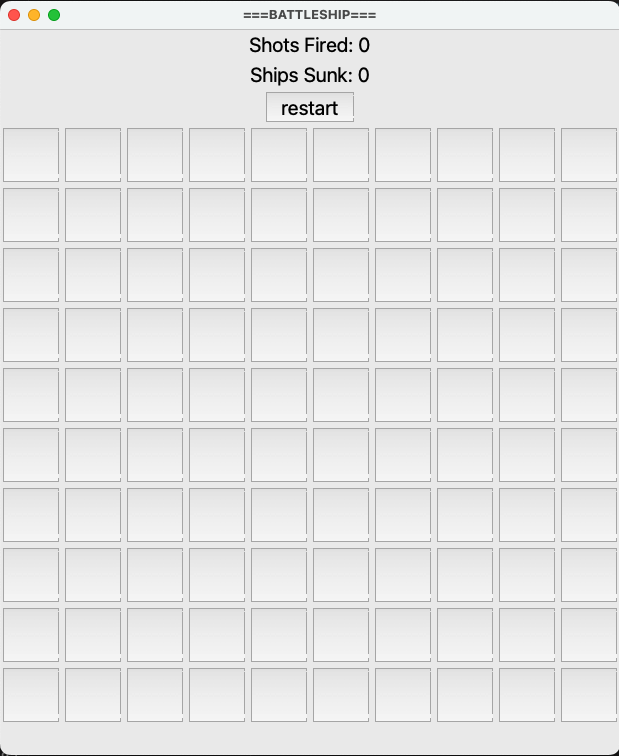

# Battleship GUI Game

## Table of Contents
1. [Introduction](#introduction)
2. [Features](#features)
3. [Screenshots](#screenshots)
4. [Installation](#installation)
5. [How to Play](#how-to-play)
6. [Game Rules](#game-rules)
7. [Technologies Used](#technologies-used)
8. [File Structure](#file-structure)
9. [Future Improvements](#future-improvements)

## Introduction

The **Battleship GUI Game** is a Python-based recreation of the classic game Battleship.

## Screenshots
Here’s a screenshot of the game in action:




## Installation
```
git clone https://github.com/PaursaK/BattleshipGUI.git
cd BattleshipGUI
```

## How to Play

A Graphical User Inteferace window will pop up and the game will commence. Users can select different coordinates to strike in an attempt to sink 10 ships that hidden in the 10x10 ocean array.

The game record the number of shots fired, hit count and overall ships sunk. A user wins by sinking all 10 ships.

## Technologies Used

Python, Tkinter, Random, Copy

## File Structure
```
BattleshipGUI/
│
├── .idea
├── pycache
├── assets/
│   ├── GUI.png                  # GUI Design Image
│   ├── Active Gameplay.png      # Active Playing Image
│   ├── Game Win.png             # Game Win Image
├── src/
│   ├── main.py             # Main game entry point
│   ├── Battleship.py       # Subclass of Ship 
│   ├── Cruiser.py          # Subclass of Ship 
│   ├── Destroyer.py        # Subclass of Ship 
│   ├── Submarine.py        # Subclass of Ship
│   ├── EmptySea.py         # Subclass of Ship (makes implementation easier if "Ship" type)
│   ├── Ocean.py            # Class representing the gameboard
│   ├── OceanTest.py        # Unit Test file for testing different features of the Ocean Class 
│   ├── Ship.py             # Parent/Super Class dedicated to defining the Ship object
│   └── ShipTest.py         # Unit Test file for testing different features of the Ship Class 
└── README.md               # This file
```

## Future Improvements
- **Two-Way Mode**: Add an option for a user to play against a computer player locally.
- **Enhanced UI**: Enhance the game experience with more quality UI design and additional features such as sound effects.


